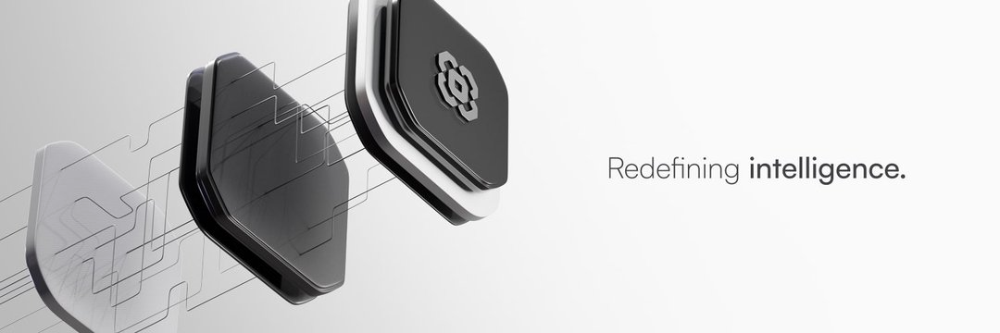
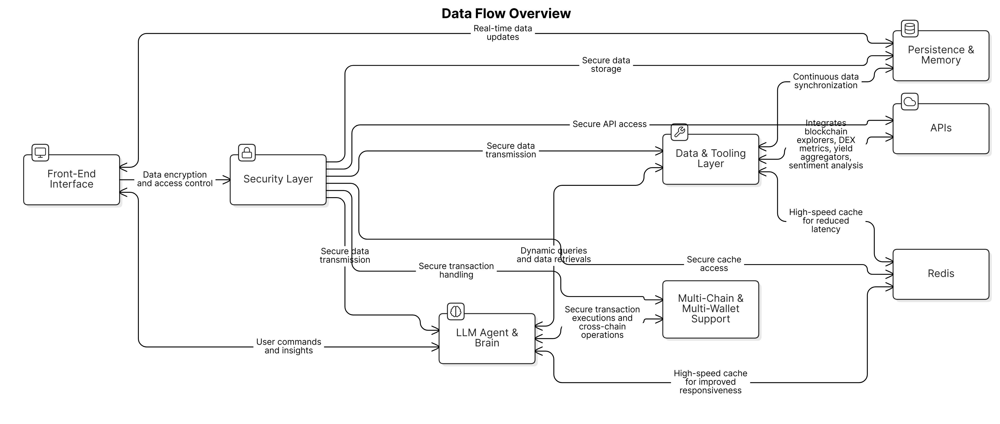
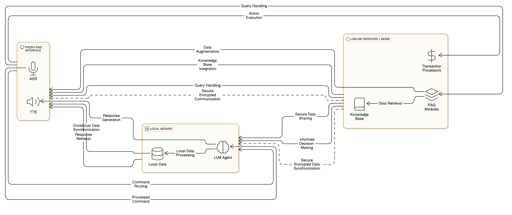

<h1 style="height: 200px; overflow: hidden; ">
  
</h1>

# LIMITUS
LIMITUS is a privacy-centric, AI-powered automation platform designed to transform your devices into autonomous agents. It supports multi-step workflows and complex tasks, such as DeFi trading, while ensuring your data remains secure whether deployed locally or in the cloud.

## Features

- **Voice Driven Complex Task Automation**: Automate complex workflows on your device.
- **AI-Driven Insights**: Leverage Custom fine-tuned Llama models for smart data analysis and decision-making.
- **Privacy-First Deployment**: Choose between encrypted cloud hosting or secure local deployment to maintain full control over your data.
- **Seamless Integration**: Connect with vector databases in real-time for data retrieval but manage user-specific data locally.

## Architecture

### Cloud Architecture

LIMITUS utilizes a Kubernetes-managed cloud infrastructure to ensure scalable and secure AI inference and data retrieval. This setup leverages encrypted pipelines, microservices for modular processing, Redis for caching, and vector databases for real-time queries. The cloud deployment guarantees high availability and performance, making it ideal for users requiring remote access and global reach without compromising on security.

### Local Architecture

For maximum privacy and control, LIMITUS provides an LLM exe that can be deployed locally on your home network. A simple executable sets up a private LLM server, utilizing FAISS/SQLite for local vector searches and storage. The local setup includes a secure API endpoint accessible only within the home network, ensuring that all data processing and storage remain in-house. This architecture is perfect for users and businesses that prioritize data sovereignty and require offline capabilities for sensitive operations.
